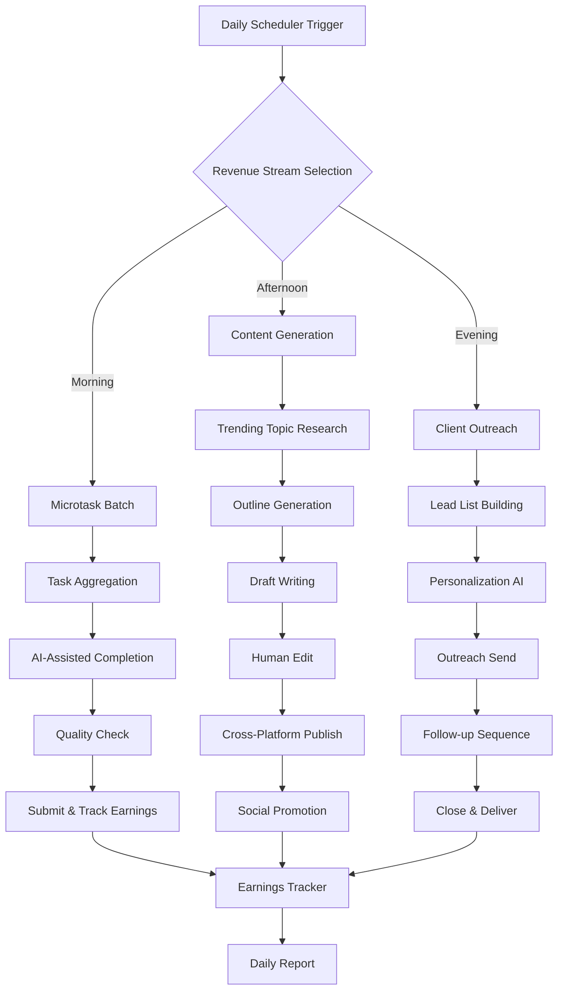

# Zero-Capital Income Generation System: $3-$30/Day
## AI Agent Implementation Plan

---

## Executive Summary

This plan identifies and implements a **hybrid AI-powered content + micro-freelance orchestration system** that requires $0 starting capital and can realistically generate $3-$30 per day within 30 days of launch.

---

## Phase 1: Opportunity Analysis

### Market Landscape (2025)

| Opportunity | Daily Earning Potential | Time to First $ | Scalability | AI-Agent Ready |
|-------------|------------------------|-----------------|-------------|----------------|
| **Microtasks (MTurk/Appen)** | $3-10 | 1 day | Low | Yes |
| **AI Freelance Writing** | $10-50 | 3-7 days | High | Yes |
| **Content Publishing** | $5-30 | 14-30 days | Medium | Yes |
| **Online Tutoring** | $10-20 | 7-14 days | Medium | Partial |
| **AI Art/Design (PoD)** | $5-20 | 30+ days | High | Yes |

### Selected Strategy: "The AI Content Arbitrage Loop"

**Core Concept**: Combine three zero-capital streams into an automated workflow:
1. **Research & Content Generation** (AI-powered)
2. **Publishing on Revenue-Sharing Platforms** (Medium, Vocal, HubPages)
3. **Supplemental Micro-Tasks** (MTurk/Appen for immediate cash flow)

---

## Phase 2: System Architecture

### Revenue Stream A: Content Publishing Engine
**Target**: $5-15/day by Day 30

**Platforms**:
- **Medium Partner Program** - Pays based on member reading time ($0.02-0.05/minute)
- **Vocal.Media** - $3.80 per 1000 reads + $6/1000 reads for Vocal+ members
- **HubPages** - Ad revenue share

**Daily Workflow**:
1. Trending topic research (AI-powered)
2. Article generation (AI-assisted)
3. Human editing/refinement
4. Cross-platform publishing
5. SEO optimization
6. Social promotion

**Content Strategy**:
- 2 articles/day x 30 days = 60 articles
- Target 1000+ reads/article = $228-342/month from Vocal alone
- Medium adds variable revenue based on engagement

### Revenue Stream B: AI-Enhanced Microtasks
**Target**: $3-10/day immediate cash flow

**Platforms**:
- **Amazon MTurk** - Data validation, surveys, transcription
- **Appen** - AI training data tasks
- **Clickworker** - Content moderation, categorization

**AI Enhancement**:
- Use AI for transcription verification
- Automate repetitive categorization tasks
- Batch process similar tasks

### Revenue Stream C: Cold Outreach Freelance
**Target**: $10-30/day by Day 21

**Service**: AI-Powered Business Writing
- Cold email sequences
- LinkedIn profile optimization
- Company blog posts
- Product descriptions

**Client Acquisition** (Zero-Capital):
1. LinkedIn direct outreach
2. Reddit/IndieHackers community engagement
3. Twitter/X DM campaigns
4. Email scraping + personalized outreach

---

## Phase 3: Implementation Timeline

### Week 1: Foundation & Immediate Cash
**Goal**: $3-5/day from microtasks

| Day | Action | Output |
|-----|--------|--------|
| 1 | Setup MTurk, Appen, Clickworker accounts | 3 active accounts |
| 2 | Complete qualification tests | Access to paid tasks |
| 3-7 | 4 hours/day microtasks | $15-35 accumulated |

### Week 2: Content Machine Launch
**Goal**: $5-10/day combined (microtasks + content)

| Day | Action | Output |
|-----|--------|--------|
| 8 | Setup Medium, Vocal, HubPages accounts | 3 publishing platforms |
| 9 | Create content calendar (30 topics) | Editorial pipeline |
| 10-14 | Publish 2 articles/day (10 articles) | Content library growing |
| 14 | Begin social promotion | Traffic building |

### Week 3: Freelance Outreach
**Goal**: $10-20/day combined

| Day | Action | Output |
|-----|--------|--------|
| 15 | Create service portfolio (3 templates) | Sales materials ready |
| 16-17 | LinkedIn/Twitter outreach (50 contacts/day) | 200+ prospects contacted |
| 18-21 | Follow-up + service delivery | First 2-3 clients landed |

### Week 4: Optimization & Scale
**Goal**: $15-30/day sustained

| Day | Action | Output |
|-----|--------|--------|
| 22-25 | Analyze top-performing content | Double down on winners |
| 26-28 | Negotiate retainer clients | Predictable revenue |
| 29-30 | Systematize workflows | Sustainable daily income |

---

## Phase 4: Automation Architecture

### AI Agent Workflow Diagram

### Tools Required (All Free Tier)

| Tool | Purpose | Cost |
|------|---------|------|
| Notion/Google Sheets | Project Management | $0 |
| Grammarly Free | Editing | $0 |
| Canva Free | Graphics | $0 |
| ChatGPT/Claude | AI Writing | $0 (limited) |
| Buffer Free | Social Scheduling | $0 |
| Hunter.io Free | Email Finding | $0 (50/month) |

---

## Phase 5: Financial Projections

### Conservative Scenario (Minimum Effort)

| Week | Microtasks | Content | Freelance | Daily Total |
|------|------------|---------|-----------|-------------|
| 1 | $3 | $0 | $0 | $3 |
| 2 | $4 | $1 | $0 | $5 |
| 3 | $5 | $3 | $2 | $10 |
| 4+ | $5 | $5 | $5 | $15 |

### Optimized Scenario (Full Effort)

| Week | Microtasks | Content | Freelance | Daily Total |
|------|------------|---------|-----------|-------------|
| 1 | $5 | $0 | $0 | $5 |
| 2 | $5 | $3 | $2 | $10 |
| 3 | $5 | $8 | $10 | $23 |
| 4+ | $3 | $10 | $15 | $28 |

---

## Risk Mitigation

### Platform Risk
- **Diversification**: Never rely on single platform
- **Email List**: Build owned audience from day one
- **Backup Plan**: Maintain 3+ active income streams

### Algorithm Risk
- **SEO Independence**: Focus on direct traffic + email
- ** evergreen Content**: Write timeless topics
- **Repurposing**: One article → 5+ formats

### Burnout Prevention
- **Batching**: 2-3 intense days + 4 lighter days
- **Templates**: 80% templated, 20% custom
- **AI Leverage**: Automate repetitive tasks

---

## Success Metrics

### Daily KPIs
- Articles published: 2
- Microtask earnings: $3+
- Outreach messages: 20+
- Content reads: 100+

### Weekly KPIs
- New articles: 14
- Total earnings: $21-70
- Leads contacted: 100+
- Clients acquired: 1-3

### Monthly KPIs
- Total earnings: $90-300
- Published articles: 60
- Active clients: 3-5
- Email subscribers: 50+

---

## Next Steps

To implement this system:

1. **Switch to Code Mode** to build automation scripts
2. **Create account setup checklist** for all platforms
3. **Build content template library** for rapid publishing
4. **Design outreach email sequences** for client acquisition

**Immediate Action Required**: Approve this plan to proceed with technical implementation including:
- Account creation automation scripts
- Content generation templates
- Outreach tracking system
- Daily earnings dashboard
